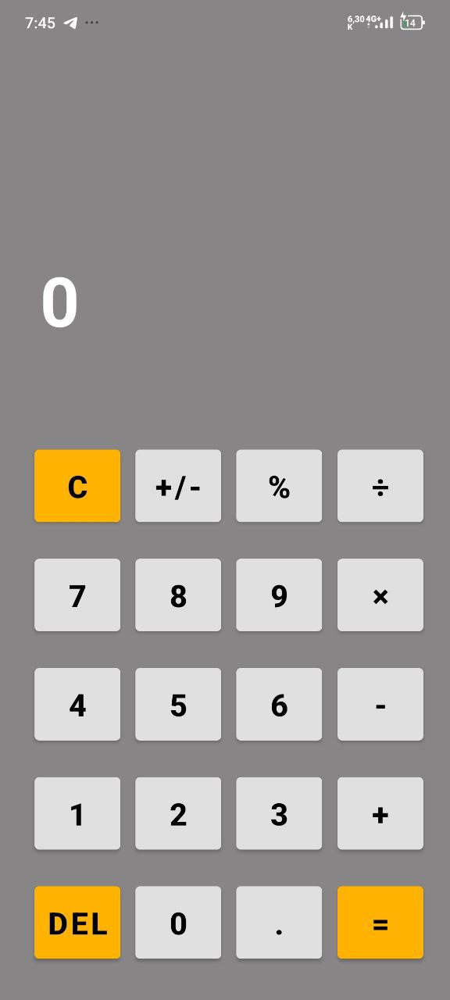

# Android Calculator
#  

Простий калькулятор для Android, написаний на Java з використанням Android SDK.  
Підтримує основні арифметичні операції та зручний інтерфейс з анімацією та вібрацією.

---

## 📖 Опис

Це класичний додаток калькулятора з такими можливостями:

- Додавання, віднімання, множення, ділення  
- Робота з десятковими числами  
- Відсоток від числа  
- Зміна знаку числа (+/-)  
- Очищення введення та видалення останнього символу  
- Анімація кнопок та результатів  
- Вібрація при натисканнях з урахуванням режиму звуку пристрою  
- Обробка помилок, наприклад, ділення на нуль з візуальним попередженням  
- Збереження стану при зміні орієнтації та інших конфігураціях пристрою

---

## 🛠️ Технології та бібліотеки

- Java  
- Android SDK  
- AndroidX AppCompat  
- Material Components

---

## 📝 Особливості реалізації

- Використання `ValueAnimator` та `ObjectAnimator` для плавних анімацій  
- Вібрація реалізована через `Vibrator` з перевіркою поточного режиму звуку  
- Стан калькулятора зберігається через `onSaveInstanceState` та відновлюється у `onRestoreInstanceState`  
- Помилки відображаються за допомогою анімації та зміни кольору тексту

---

## 📱 Скриншоти додатку

  

---

## 📞 Контакти

- Email: ffg382005@gmail.com  
- GitHub: [NikitaPOdolskiy](https://github.com/NikitaPOdolskiy)
